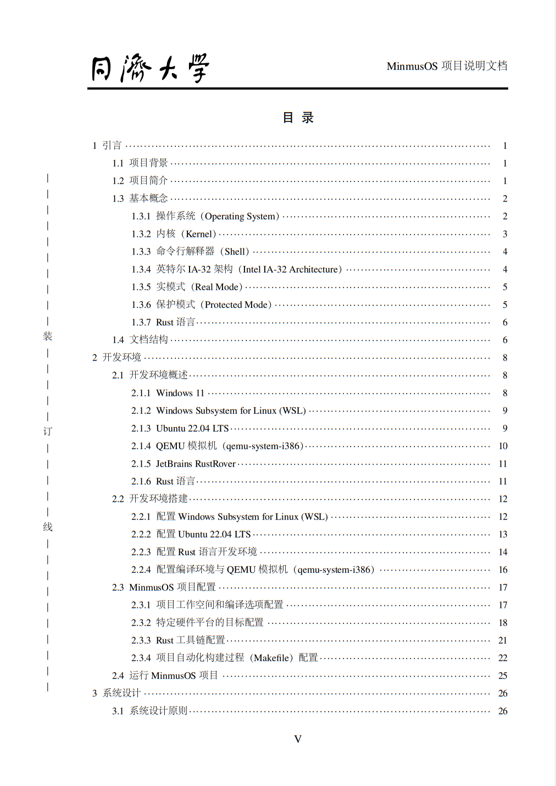
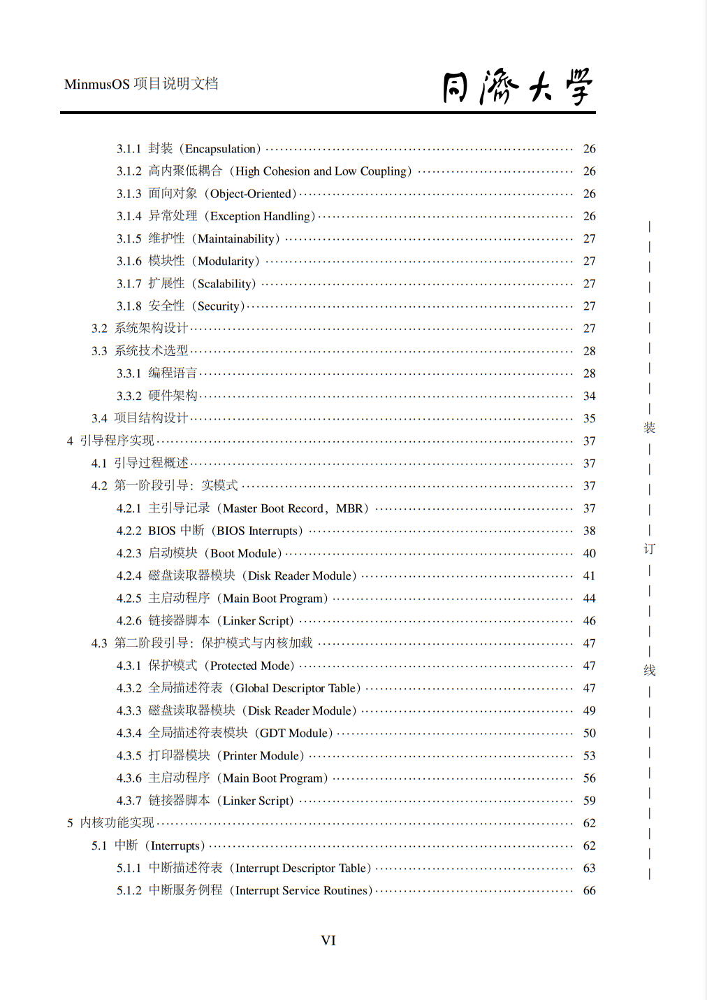
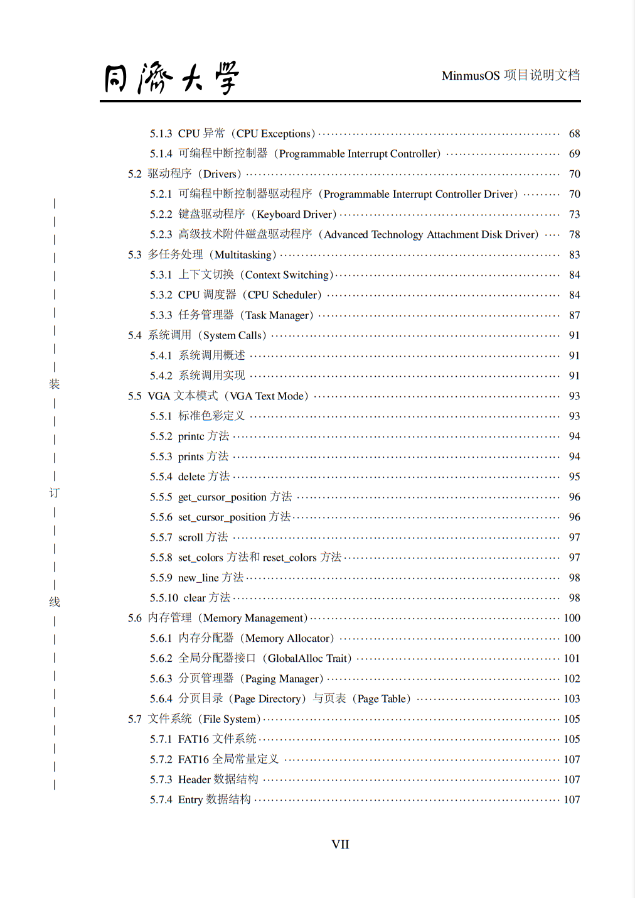
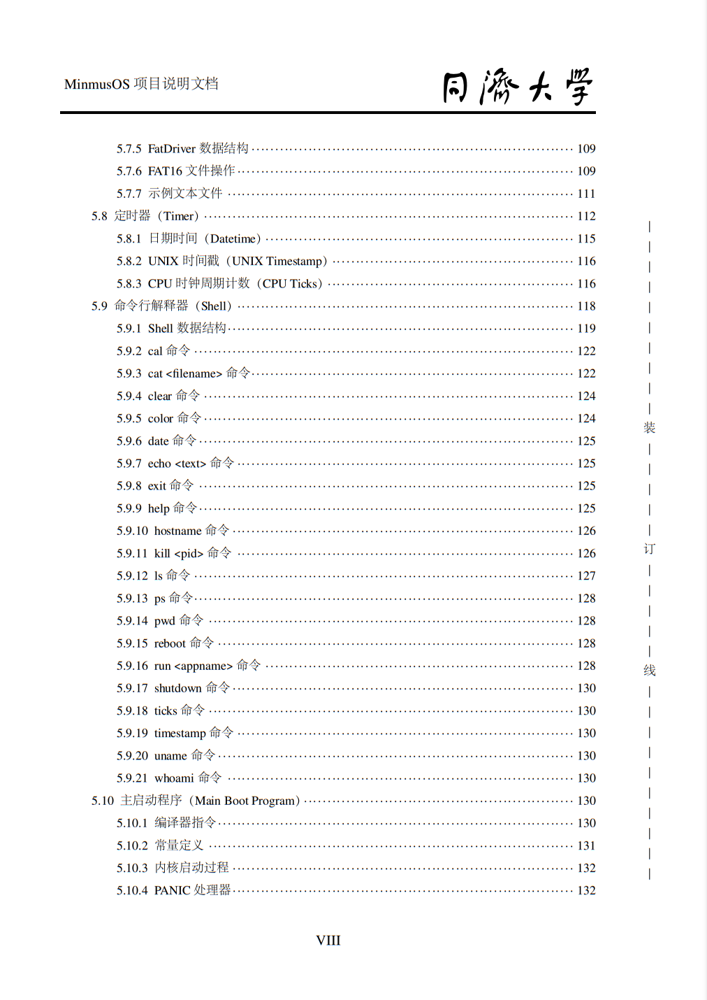
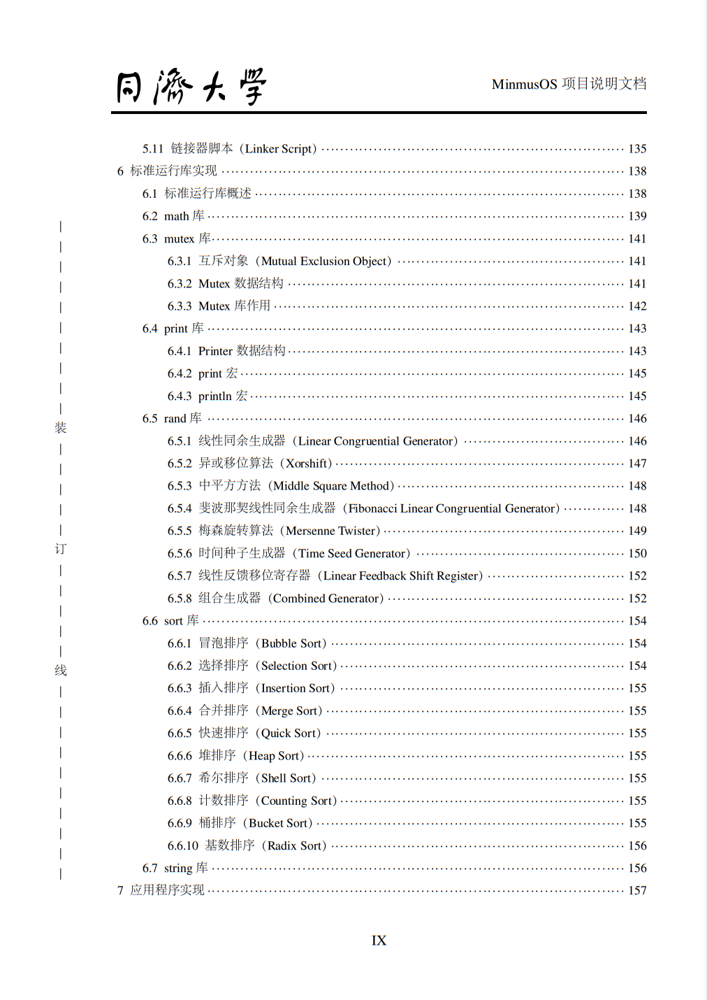
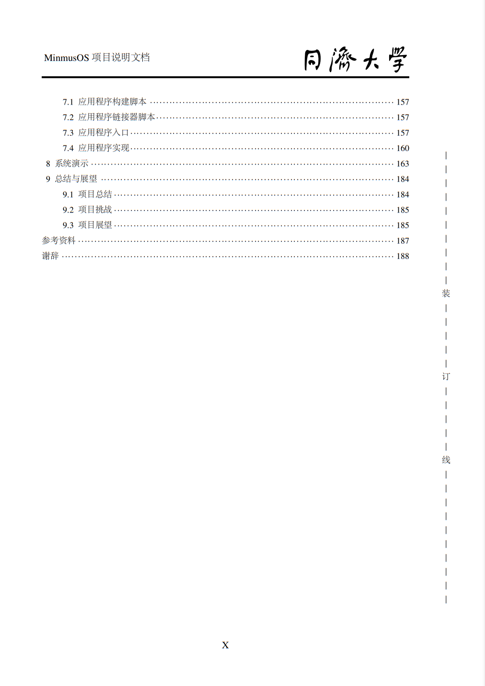
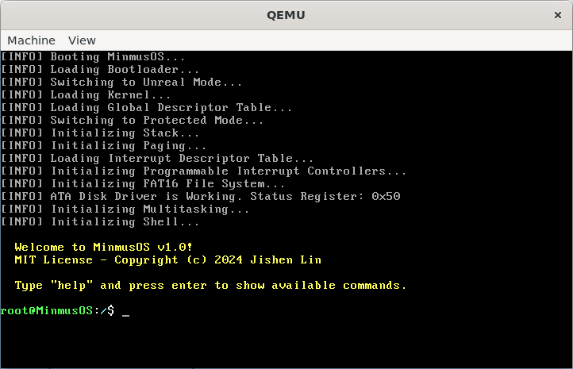
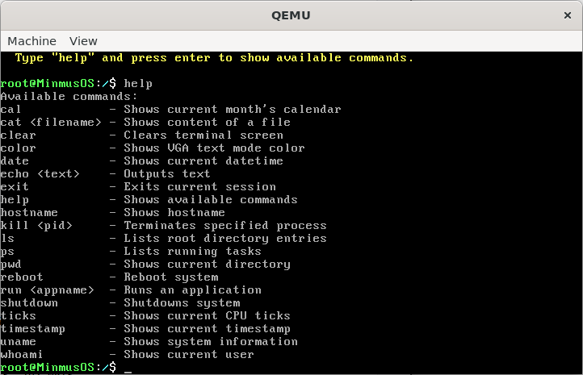
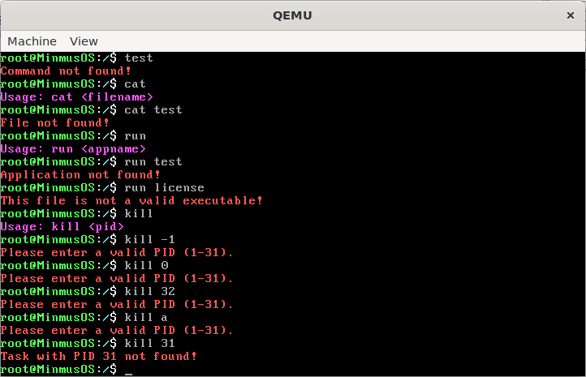
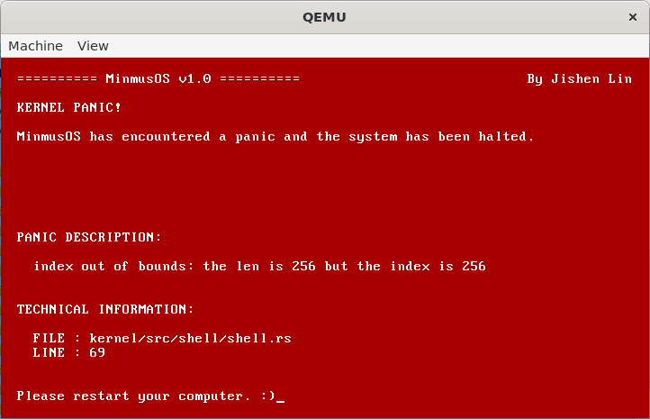

# Minmus Operating System in Rust

> [!TIP]
> For more details, please refer to the [MinmusOS Project Documentation](Documentation.pdf) (200 pages, 6.02 MB)
>
> 有关更多详细信息，请参考 [MinmusOS 项目说明文档](Documentation.pdf)（200 页，6.02 MB）
> 
> 

>   
>   
>   
>    
>   
>   
>   
> 

## 项目名称

Minmus_Operating_System_in_Rust

## 项目简介

MinmusOS: The design and implementation of an operating system based on Rust language.

MinmusOS: 基于 Rust 语言的操作系统的设计与实现。

> ***Relevant course***
> * Operating System Course Project 2024 (2024年同济大学操作系统课程设计)

MinmusOS 是一个基于 Rust 语言和 Intel IA-32（x86）架构开发的多任务操作系统，它实现了系统内核与用户空间的分离，并允许用户使用标准运行库开发用户应用程序。

MinmusOS 的功能：

* 引导程序
  * 引导 MinmusOS
  * 切换到非真实模式（在 16 位实模式下使用 32 位地址）
  * 加载内核（从磁盘将内核复制到受保护的内存）
  * 加载全局描述符表
  * 切换到保护模式
  * 跳转内核
* 内核
  * 加载中断描述符表
  * CPU 异常处理器与 PANIC 处理器
  * 可编程中断控制器（8259 PIC）驱动程序
  * PS/2 键盘驱动程序
  * ATA 磁盘驱动程序
  * CPU 轮转调度器
  * 任务管理器
  * 系统调用
  * VGA 文本模式
  * 页式内存管理
  * FAT16 文件系统
  * RTC 定时器
  * 命令行解释器支持 20 种可执行命令
* 标准运行库
  * math 数学库
  * mutex 互斥库
  * print 打印库
  * rand 随机数生成库
  * sort 排序库
  * string 字符串处理库
* 应用程序
  * 汉诺塔解决方案应用程序
  * 允许用户使用标准运行库开发用户应用程序

## 开发环境

本项目的开发环境如下：

* 开发环境
  * Windows 11 家庭中文版 23H2
  * Windows Subsystem for Linux (WSL) 2.2.4.0
  * Ubuntu 22.04.3 LTS
  * QEMU 模拟机（qemu-system-i386）6.2.0
* 开发软件
  * JetBrains RustRover 2024.1.7
* 开发语言
  * Rust 语言（Rustup：1.27.1，Rustc：1.82.0-nightly，Cargo：1.82.0-nightly）

## 系统架构

## 项目组成

* `/LaTeX`
项目说明文档 $\LaTeX$ 源代码

* `/MinmusOS`
MinmusOS 源代码

* `Documentation.pdf`
MinmusOS 项目说明文档

## 系统演示

## 谢辞

从零开始实现一个操作系统，是我本科期间一次独特且宝贵的经历。这一路走来，实属不易。

实现操作系统的想法可以追溯到2024年寒假，当时我主要学习川合秀实所著的《30天自制操作系统》。然而，这本书所依赖的工具链过于陈旧，必须使用书中提供的编译器和特有的非标准函数，启动区更是为2.88MB软盘设计的。由于没有使用标准编译器，作为初学者的我必须严格按照教程操作，这让我在开发过程中感到束手束脚，无法灵活地增添新功能，这并不是我所追求的。

之后，我转而学习于渊所著的《Orange'S：一个操作系统的实现》，但因其难度过大，最终放弃。

4月，我在Bilibili平台偶然发现了一位宝藏UP主LunaixSky，他发布了一系列视频教程《从零开始自制操作系统》。这位作者的操作系统LunaixOS及相关教程完全原创，未参考任何现有的操作系统开发书籍或开源内核代码。为了编写这套教程，他耗费了大量时间和精力钻研技术文档和现行工业标准，力求知识的独创性。但随着教程的深入和项目的频繁重构，我在跟随教程到分页与内核重映射部分时便跟不上了。Git提交记录和视频教程的不完全对应加大了我的学习难度，让我最终不得不选择放弃。然而，这段学习经历让我受益匪浅，不仅提升了我的技术理解能力，还让我真正领悟到了开发操作系统的魅力，并培养了我查阅Intel®64与IA-32架构软件开发者手册等官方技术文档的能力。加入作者的LunaixOS技术交流群，更让我感受到了开源精神的伟大。

在期末周结束后的小学期，我重拾起这个项目。面对C语言中指针满天飞带来的复杂性和潜在的不安全因素，我做出了一个重要决定：将MinmusOS的编程语言从C语言改为Rust语言。Rust的开发体验相比C语言无疑更加出色。C语言中的许多不安全或未定义行为，往往只能在运行时暴露出问题或被隐藏，而Rust则通过其严格的安全性检查，在编译期就能有效避免这些错误。这种安全性和可靠性，极大地提升了我的开发效率。

自此，我不断在OS Dev Wiki学习并查阅Intel IA-32架构软件开发者手册，逐步完成了引导程序、内核、标准运行库与应用程序的实现。从最初学习和复现别人的代码，到逐渐成长为能够独立实现自定义功能的开发者，甚至为开源社区贡献代码、修复Bug，我感受到自己编程能力的巨大进步，也体会到了从无到有实现一个项目的成就感。回首整个项目，于我而言，这不仅仅是一项课程设计，更是我技术生涯中的重要里程碑。

在此，我要衷心感谢张惠娟老师和王冬青老师对于操作系统理论的教授，并让我有这个机会从零开始实现一个操作系统。感谢开源社区和OS Dev Wiki的贡献者们，是你们的无私分享让我不断增加对操作系统开发的理解。更要感谢一路坚持、没有因为技术难题而放弃的自己。最后，感谢阅读至此的你，愿你也能在自己的学习与探索中找到属于自己的光芒。

## 免责声明

The code and materials contained in this repository are intended for personal learning and research purposes only and may not be used for any commercial purposes. Other users who download or refer to the content of this repository must strictly adhere to the **principles of academic integrity** and must not use these materials for any form of homework submission or other actions that may violate academic honesty. I am not responsible for any direct or indirect consequences arising from the improper use of the contents of this repository. Please ensure that your actions comply with the regulations of your school or institution, as well as applicable laws and regulations, before using this content. If you have any questions, please contact me via [email](mailto:minmuslin@outlook.com).

本仓库包含的代码和资料仅用于个人学习和研究目的，不得用于任何商业用途。请其他用户在下载或参考本仓库内容时，严格遵守**学术诚信原则**，不得将这些资料用于任何形式的作业提交或其他可能违反学术诚信的行为。本人对因不恰当使用仓库内容导致的任何直接或间接后果不承担责任。请在使用前务必确保您的行为符合所在学校或机构的规定，以及适用的法律法规。如有任何问题，请通过[电子邮件](mailto:minmuslin@outlook.com)与我联系。

## 文档更新日期

2024年8月27日